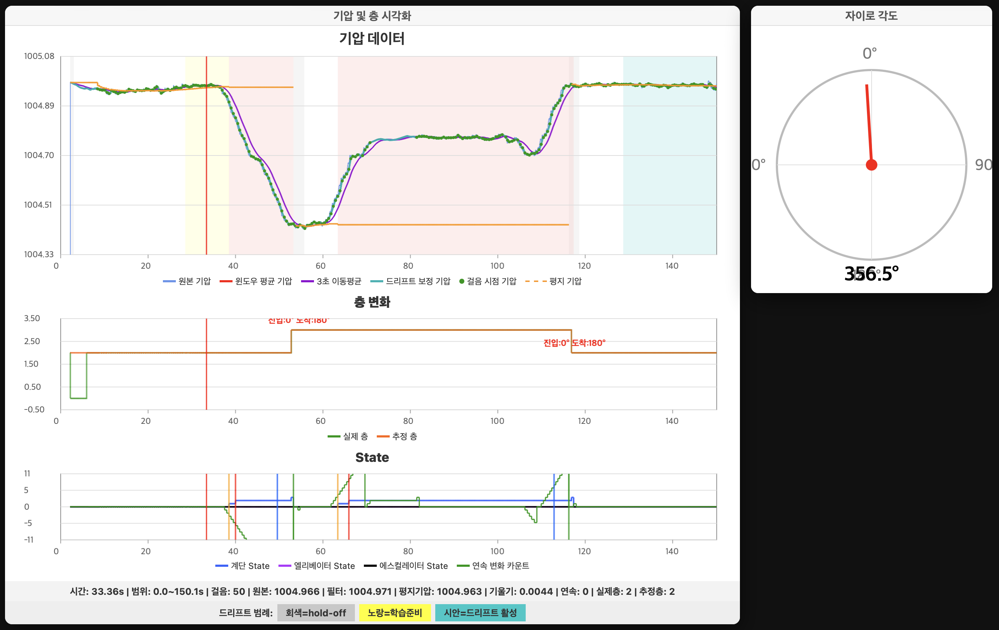
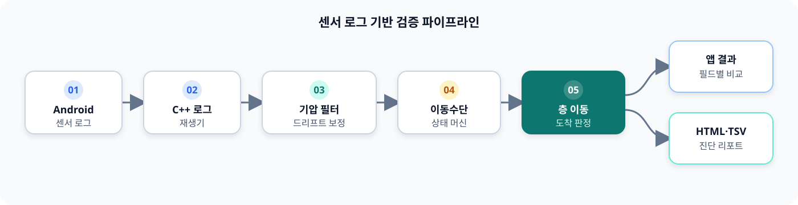

# 기압 기반 층 이동 감지 시뮬레이터

스마트폰 기압 센서와 보행 정보를 재생해 실내 층 이동 감지 로직을 검증하는 C++ 시뮬레이터 개발 사례입니다.

## 프로젝트 개요

| 구분 | 내용 |
| --- | --- |
| 분야 | Android 실내 측위·보행자 추측항법(PDR) |
| 목표 | 계단·엘리베이터·에스컬레이터 이용 시 층 이동과 도착 시점 감지 |
| 입력 | 스마트폰 기압, 걸음, 자이로, 현재 위치가 기록된 센서 로그 |
| 출력 | 필터·보정 기압, 이동수단 상태, 실제층·추정층, 상태 전이 시점 |
| 기술 | C++17, Kotlin/Android, HTML Canvas, TSV |
| 담당 | 층 이동 로직 C++ 포팅·통합, 로그 재생 시뮬레이터, 기압 보정과 예외 처리, 진단 시각화 |

## 문제

스마트폰 기압은 고도 변화에 반응하지만 센서 노이즈와 장시간 드리프트가 함께 발생합니다. 계단, 엘리베이터, 에스컬레이터는 변화 속도와 보행 패턴도 서로 다릅니다. 실기기 보행만으로 로직을 수정하면 같은 조건을 반복하기 어렵고, 어느 상태 전이에서 오판이 시작됐는지 추적하는 데 시간이 오래 걸렸습니다.

## 접근 방법

- 앱에서 기록한 센서 이벤트의 순서와 시각을 보존해 C++ 엔진에 재입력했습니다.
- 원본 기압, 윈도우 평균, 3초 이동평균과 드리프트 보정값을 같은 시간축에서 비교했습니다.
- 평지 구간에서 장기 드리프트를 학습하고, 층 이동 직후에는 보정 학습을 잠시 중단해 실제 고도 변화를 드리프트로 흡수하지 않도록 했습니다.
- 변화율과 걸음 패턴을 함께 사용해 계단·엘리베이터·에스컬레이터 상태를 구분했습니다.
- 기압 변화가 안정된 뒤 층 도착을 확정하고, `B1 → 1F`처럼 0층이 없는 건물 층 체계를 별도로 처리했습니다.

## 화면 구성

- **기압 데이터:** 원본, 윈도우 평균, 이동평균, 드리프트 보정, 걸음 시점 기압과 평지 기준값
- **층 변화:** 실제층과 추정층, 이동 구간의 진입·도착 방향
- **State:** 계단·엘리베이터·에스컬레이터 상태와 연속 변화 카운트
- **자이로 각도:** 이동 방향과 층 이동 후 방향 정합성 확인

## 검증 방식

- 동일 로그를 반복 재생해 수정 전후 결과를 같은 입력으로 비교
- Android 앱이 기록한 층·상태 값과 시뮬레이터 출력을 TSV에서 필드별 대조
- 계단 유턴, 여러 층 연속 이동, 이동 직후 방향 전환, 기압 드리프트 등의 실패 사례 재현
- 상태 전이 시점을 그래프에 표시해 오판이 시작된 구간을 역추적

## 담당 작업과 결과

- Android/Kotlin 층 이동 감지 로직을 C++로 포팅하고 PDR 엔진과 통합했습니다.
- 앱과 같은 입력을 재생하는 회귀 하네스를 구축해 실기기 재보행 없이 오류를 반복 재현할 수 있게 했습니다.
- 기압 드리프트 보정과 층 도착 안정화 로직을 개선했습니다.
- 계단·에스컬레이터 이동, 유턴, 다중 층 이동에서 발생하는 예외를 수정했습니다.
- 상태 전이와 기압 시계열을 함께 보여주는 HTML/TSV 리포트를 구현해 원인 분석 과정을 단축했습니다.

## 공개 범위

실제 서비스 엔진은 지도, Wi-Fi 측위, PDR, 시설별 튜닝 및 공동 연구 자산과 결합되어 있어 공개하지 않습니다. 이 저장소에는 프로젝트의 문제 해결 과정과 비식별화된 실행 화면만 담았습니다.
